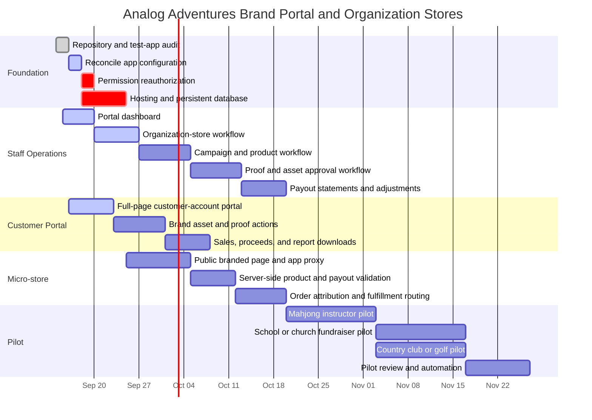

# Analog Adventures Brand Portal roadmap

This plan extends one Shopify store into three coordinated customer paths:
retail shopping, bulk/custom quotes, and branded organization micro-stores.
Analog Adventures remains the merchant of record and each organization receives
a controlled portal rather than a separate Shopify installation.

## Delivery Gantt

## Current implementation

| Capability                  | Status                 | Notes                                                                                                 |
| --------------------------- | ---------------------- | ----------------------------------------------------------------------------------------------------- |
| Correct test-app identity   | Complete               | Client ID ending in `8777` is canonical                                                               |
| Shopify custom-data model   | Complete in test store | Brand, production, store, campaign, proof, and payout definitions exist                               |
| Staff dashboard             | Built locally          | Reads live metaobject counts and readiness                                                            |
| Organization-store creation | Built locally          | Connects a micro-store record to a Shopify company                                                    |
| Campaign creation           | Built locally          | Selects organization, dates, products, payout rule, pricing, and fulfillment                          |
| Payout oversight            | Built locally          | Displays rules and settlement records                                                                 |
| Customer-account portal     | Built locally          | Authenticated full-page extension with organization, campaign, and proceeds data                      |
| Public micro-store          | Built locally          | App proxy serves live organization campaigns and their selected products at `/community/stores/:slug` |
| Proof/asset actions         | Not started            | Must preserve immutable asset versions                                                                |
| Order attribution           | Built locally          | Signed variant tokens are verified on `orders/create` before app-owned order metafields are written   |
| Automated payouts           | Not started            | Pilot manually before automating financial settlement                                                 |

## Required launch gates

1. Validate and deploy the canonical `shopify.app.toml`.
2. Approve the expanded API scopes and protected customer-data access.
3. Host the application at a stable HTTPS URL.
4. Replace development SQLite with a durable production database.
5. Set the customer extension's Portal API URL to
   `https://<app-host>/public/portal`.
6. Add the Brand Portal full-page extension in Shopify's checkout and accounts
   editor and include it in the customer-account menu.
7. Complete end-to-end testing using one internal company/contact before the
   first external pilot.

## Pilot acceptance criteria

- A customer can sign in and see only organizations connected to their Shopify
  company contact.
- Staff can create an organization store and campaign without Shopify Admin
  data entry outside the app.
- Campaign products, payout rule, dates, and fulfillment mode are immutable in
  the final settlement record.
- Every attributed order contains server-validated organization, campaign, and
  artwork-version identifiers.
- Refunds and adjustments are included before proceeds are marked paid.
- Closed campaigns and approved artwork are archived, never deleted.
