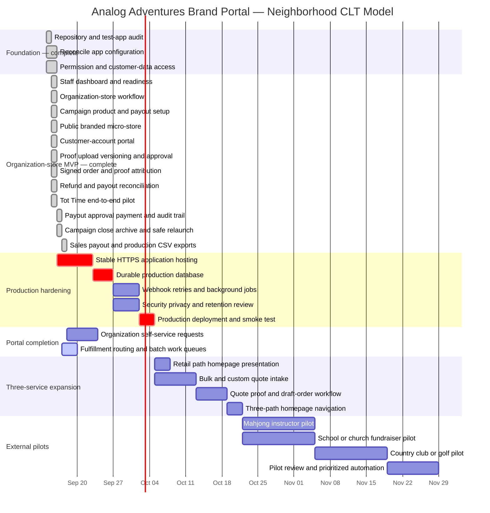

# Analog Adventures Brand Portal roadmap

This plan extends one Shopify store into three coordinated customer paths:
retail shopping, bulk/custom quotes, and branded organization micro-stores.
Analog Adventures remains the merchant of record and each organization receives
a controlled portal rather than a separate Shopify installation.

## Delivery Gantt — updated September 17, 2026

Completed work reflects the Analog Adventures Test store. Remaining durations
are planning estimates and begin after development resumes.

## Current implementation

| Capability                             | Status              | Notes                                                                                                                                                        |
| -------------------------------------- | ------------------- | ------------------------------------------------------------------------------------------------------------------------------------------------------------ |
| Correct test-app identity              | Complete            | Client ID ending in `8777` is canonical                                                                                                                      |
| Shopify custom-data model              | Extension ready     | Brand, store, campaign, proof, payout, and production-batch definitions are version-controlled; deploy and test the new batch definition                     |
| Staff dashboard                        | Complete and tested | Reads live records and reports launch readiness without false app-owned-definition warnings                                                                  |
| Organization and campaign setup        | Complete and tested | Tot Time Preschool is connected to its company, products, dates, payout rule, and fulfillment mode                                                           |
| Public micro-store                     | Complete and tested | App proxy serves the Tot Time campaign and creates signed line attribution                                                                                   |
| Customer-account portal                | Complete and tested | Company-authorized contacts see only their store, campaigns, proofs, and statements                                                                          |
| Proof and asset actions                | Complete and tested | Upload, immutable versions, superseding, approval, and revision requests passed end to end                                                                   |
| Order and production-proof attribution | Complete and tested | Orders `#1002` and `#1003` captured approved Proof Version 2; the unapproved revision did not replace it                                                     |
| Refund and payout reconciliation       | Complete and tested | Refunds, fulfillment gating, deductions, fixed proceeds, idempotent drafts, and settlement protection passed                                                 |
| Payout approval and paid-record lock   | Complete and tested | Approval eligibility, payment confirmation, paid timestamp, and immutable settled records passed                                                             |
| Campaign lifecycle and relaunch        | Complete and tested | Close, archive, safe new-ID relaunch, preserved configuration, and paid-campaign reopening protection passed                                                 |
| Report downloads                       | Complete and tested | Sales, production, and payout CSV files download in place and reconcile to Tot Time orders and statements                                                    |
| Fulfillment routing and exports        | Built; test pending | Production exports passed; the staff queue now snapshots unfulfilled units, proof/customization data, fulfillment mode, and guarded batch status transitions |
| Bulk/custom quote workflow             | Not started         | Add guided intake, estimates, artwork review, and Shopify draft-order conversion                                                                             |
| Stable hosting and database            | Not started         | Replace temporary tunnels and SQLite before any external pilot                                                                                               |
| Automated payouts                      | Deferred            | Continue manual review and payment through initial external pilots                                                                                           |

## September 15–17 test checkpoint

- Tot Time Preschool completed the organization, campaign, storefront, customer
  portal, proof, checkout, attribution, refund, and payout-statement cycle.
- Proof Version 2 was approved. A later revision-request test did not alter the
  approved production proof.
- Orders `#1002` and `#1003` both recorded Version 2; legacy order `#1001`
  correctly shows no proof snapshot.
- Reconciliation remained idempotent after order `#1003`: it updated the
  existing statement instead of creating a duplicate.
- The follow-up audit found that `eligible_fulfilled_units` was counting
  unfulfilled orders. The correction passed: only fulfilled, non-refunded
  units now contribute to proceeds, and manual deductions reconcile correctly.
- Premature approval was blocked while the campaign remained live and inside
  its settlement delay. Close, approval, payment confirmation, paid timestamp,
  immutable paid-record locking, and archive behavior subsequently passed.
- Relaunch created campaign `TC-PILOT-002` with a new identity while preserving
  the organization, products, payout rule, pricing, production, and fulfillment
  settings from the archived campaign.
- Reopening the original archived campaign was blocked because its statement is
  paid. The original campaign and its historical statement remained unchanged.
- Authenticated sales, production, and payout CSV downloads passed. Tot Time's
  three orders reconcile to $1,540.85 gross, $785.95 refunded, one eligible
  unit, and $5.00 organization proceeds.
- The production export preserved Proof Version 2 for orders `#1002` and `#1003`,
  retained the legacy no-proof state for order `#1001`, and correctly separated
  fulfilled, unfulfilled, and cancelled/refunded quantities.
- The fulfillment workspace and app-owned production-batch schema are built for
  review. End-to-end testing remains before this phase can be marked complete.

## Required launch gates

1. Validate and deploy the canonical `shopify.app.toml`.
2. Approve the expanded API scopes and protected customer-data access.
3. Host the application at a stable HTTPS URL.
4. Replace development SQLite with a durable production database.
5. Set the customer extension's Portal API URL to
   `https://<app-host>/public/portal`.
6. Add the Brand Portal full-page extension in Shopify's checkout and accounts
   editor and include it in the customer-account menu.
7. Complete end-to-end testing using one internal company/contact before the
   first external pilot.

## Pilot acceptance criteria

- A customer can sign in and see only organizations connected to their Shopify
  company contact.
- Staff can create an organization store and campaign without Shopify Admin
  data entry outside the app.
- Campaign products, payout rule, dates, and fulfillment mode are immutable in
  the final settlement record.
- Every attributed order contains server-validated organization, campaign, and
  artwork-version identifiers.
- Refunds and adjustments are included before proceeds are marked paid.
- Closed campaigns and approved artwork are archived, never deleted.
